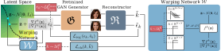

# WarpedGANSpace: Finding non-linear RBF paths in GAN latent space

Authors' official PyTorch implementation of the [WarpedGANSpace: Finding non-linear RBF paths in GAN latent space](TODO: add link to paper) [ICCV 2021]. If you use this code for your research, please cite our paper using [this](#citation) bibtex entry.


## Overview

<p align="center">

</p>


## Installation

We recommend installing the required packages using python's native virtual environment (Python 3.4+) as follows:

```bash
$ python -m venv warped-gan-space
$ source warped-gan-space/bin/activate
(warped-gan-space) $ pip install --upgrade pip
(warped-gan-space) $ pip install -r requirements.txt
```


## Training


## Evaluation


## Examples


## Citation

If you use this code for your research, please cite our paper:

```
@inproceedings{warpedganspace,
  title={{WarpedGANSpace}: Finding non-linear RBF paths in GAN latent space},
  author={Tzelepis, Christos and Tzimiropoulos, Georgios and Patras, Ioannis},
  booktitle={IEEE International Conference on Computer Vision (ICCV)},
  year={2021},
}
```


## Acknowledgment

This research was supported by the EU's Horizon 2020 programme H2020-951911 [AI4Media](https://www.ai4media.eu/) project.

