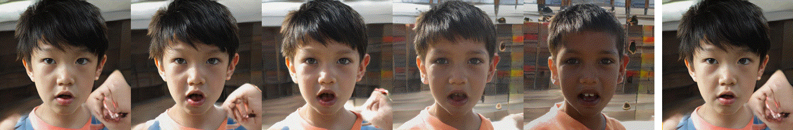
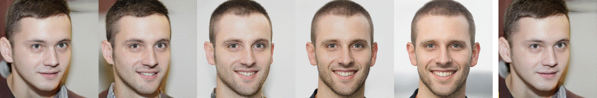
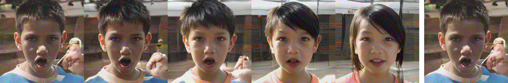
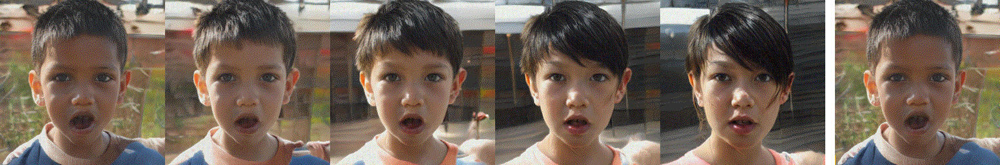
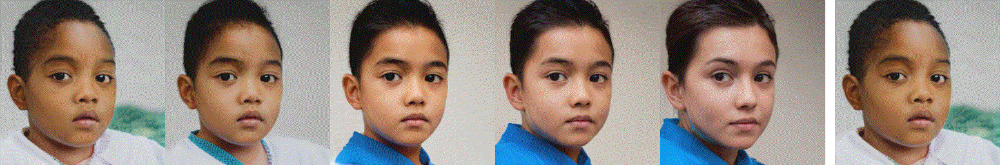
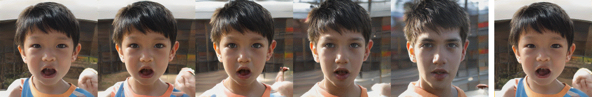

# Attribute group: Age-CelebA
## celeba_age
### Latent code: 689f0ab17f84b9cd36c0a5bdfb0469aadce4c4ba
#### Metric: corr

#### Metric: corr_l1

### Latent code: 5e9893b9508f383603de655a34750820723e1f95
#### Metric: corr

#### Metric: corr_l1

### Latent code: b4f5ac561b1837247690f0dd61b169f8b244953e
#### Metric: corr

#### Metric: corr_l1

### Latent code: 602422f65226cdd8fa492dfd38d613a793f9746f
#### Metric: corr

#### Metric: corr_l1

### Latent code: 50441c6d696cdd52c8435da33ed7bb94f550013d
#### Metric: corr

#### Metric: corr_l1

### Latent code: db6cb850f328f734a2399347858a685a152e1228
#### Metric: corr

#### Metric: corr_l1

### Latent code: 831d7611c032ed2552adfa0a9b060e692a44d2cd
#### Metric: corr

#### Metric: corr_l1

### Latent code: 323bbfd47b3132c90fc0cdd0db2c768f011667b7
#### Metric: corr

#### Metric: corr_l1

## gender
### Latent code: 689f0ab17f84b9cd36c0a5bdfb0469aadce4c4ba
#### Metric: corr

#### Metric: corr_l1

### Latent code: 5e9893b9508f383603de655a34750820723e1f95
#### Metric: corr

#### Metric: corr_l1

### Latent code: b4f5ac561b1837247690f0dd61b169f8b244953e
#### Metric: corr

#### Metric: corr_l1

### Latent code: 602422f65226cdd8fa492dfd38d613a793f9746f
#### Metric: corr

#### Metric: corr_l1

### Latent code: 50441c6d696cdd52c8435da33ed7bb94f550013d
#### Metric: corr

#### Metric: corr_l1

### Latent code: db6cb850f328f734a2399347858a685a152e1228
#### Metric: corr

#### Metric: corr_l1

### Latent code: 831d7611c032ed2552adfa0a9b060e692a44d2cd
#### Metric: corr

#### Metric: corr_l1

### Latent code: 323bbfd47b3132c90fc0cdd0db2c768f011667b7
#### Metric: corr

#### Metric: corr_l1

## race
### Latent code: 689f0ab17f84b9cd36c0a5bdfb0469aadce4c4ba
#### Metric: corr

#### Metric: corr_l1

### Latent code: 5e9893b9508f383603de655a34750820723e1f95
#### Metric: corr

#### Metric: corr_l1

### Latent code: b4f5ac561b1837247690f0dd61b169f8b244953e
#### Metric: corr

#### Metric: corr_l1

### Latent code: 602422f65226cdd8fa492dfd38d613a793f9746f
#### Metric: corr

#### Metric: corr_l1

### Latent code: 50441c6d696cdd52c8435da33ed7bb94f550013d
#### Metric: corr

#### Metric: corr_l1

### Latent code: db6cb850f328f734a2399347858a685a152e1228
#### Metric: corr

#### Metric: corr_l1

### Latent code: 831d7611c032ed2552adfa0a9b060e692a44d2cd
#### Metric: corr

#### Metric: corr_l1

### Latent code: 323bbfd47b3132c90fc0cdd0db2c768f011667b7
#### Metric: corr

#### Metric: corr_l1

